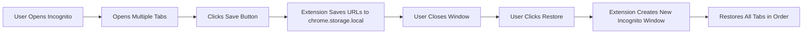

<div align="center">
  

  # RecoverMyWeb

  **Never lose your incognito tabs again.**

  A Chrome extension that saves and restores your incognito window tabs with one click.

  [](https://github.com/Jeffrey0117/recovermyweb)
  [](https://opensource.org/licenses/MIT)
  [](https://github.com/Jeffrey0117/recovermyweb/stargazers)

  [Features](#-features) •
  [Installation](#-installation) •
  [Usage](#-usage) •
  [Why?](#-why) •
  [Contributing](#-contributing)

</div>

---

## 🎯 Why RecoverMyWeb?

<table>
<tr>
<td width="50%">

### 😫 The Problem

- **15+ tabs open** for research in incognito mode
- **Wrong click** → Window closes
- **All tabs gone** forever
- **No history, no recovery**
- Chrome doesn't restore incognito sessions

</td>
<td width="50%">

### ✨ The Solution

- **One-click save** your incognito session
- **One-click restore** all tabs
- **Survives Chrome restarts**
- **Privacy-first** - all data stays local
- **Simple & fast** - no bloat

</td>
</tr>
</table>

---

## ✨ Features

<table>
<tr>
<td>

🔐 **Privacy First**
- All data stored locally
- No external servers
- No tracking or analytics
- Open source

</td>
<td>

⚡ **Fast & Simple**
- One-click save & restore
- Clean, intuitive UI
- No complex setup
- Lightweight extension

</td>
</tr>
<tr>
<td>

💾 **Persistent Storage**
- Survives Chrome restarts
- Saves up to 3 sessions
- 7-day retention
- Auto-cleanup old data

</td>
<td>

🎯 **Tab Preservation**
- Exact tab order restored
- Pinned tabs maintained
- Smart URL filtering
- Handles 50+ tabs easily

</td>
</tr>
</table>

---

## 🚀 Installation

### Option 1: Chrome Web Store (Coming Soon)

*Pending review*

### Option 2: Manual Installation

1. **Clone this repository**
   ```bash
   git clone https://github.com/Jeffrey0117/recovermyweb.git
   cd recovermyweb
   ```

2. **Open Chrome Extensions**
   - Navigate to `chrome://extensions/`
   - Enable **Developer mode** (top-right toggle)

3. **Load the extension**
   - Click **Load unpacked**
   - Select the `recovermyweb` folder
   - ✅ Done!

---

## 📖 Usage

### Save Your Session

```
1. Open incognito window (Ctrl+Shift+N)
2. Open tabs you want to save
3. Click RecoverMyWeb icon → "Save Current Session"
4. ✅ Session saved!
```

### Restore Your Tabs

```
1. Click RecoverMyWeb icon
2. View saved tabs count and timestamp
3. Click "Restore All Tabs"
4. ✅ New incognito window opens with all tabs!
```

### Clear Saved Data

```
Click RecoverMyWeb icon → "Clear Snapshot"
```

---

## 🛠️ Tech Stack

| Technology | Purpose |
|------------|---------|
| **Chrome Extension Manifest v3** | Modern extension framework |
| **Vanilla JavaScript** | Zero dependencies, fast loading |
| **chrome.storage.local API** | Persistent local storage |
| **chrome.tabs API** | Tab management & restoration |
| **CSS3** | Clean, responsive UI |

---

## 🔒 Privacy & Security

<table>
<tr>
<td width="50%">

### ✅ What We Do
- Store tab URLs & titles **locally**
- Preserve tab order & pinned state
- Auto-cleanup after 7 days

</td>
<td width="50%">

### ❌ What We Don't Do
- No external data transmission
- No cookies or session data stored
- No browsing history tracking
- No analytics or telemetry

</td>
</tr>
</table>

### Permissions Required

| Permission | Why We Need It |
|------------|----------------|
| `tabs` | Read tab URLs and titles to save sessions |
| `storage` | Save session data locally in your browser |

**That's it.** No hidden permissions, no unnecessary access.

---

## 📊 How It Works



---

## 🚧 Known Limitations

| Limitation | Reason | Workaround |
|------------|--------|------------|
| Manual save required | Chrome API doesn't reliably trigger on window close | Click "Save" before closing |
| Can't restore `chrome://` URLs | Chrome security restriction | System pages are auto-filtered |
| Single session view | MVP feature set | All 3 recent sessions are stored |
| No cloud sync | Privacy-first design | Sessions are device-local only |

---

## 🗺️ Roadmap

- [ ] **Auto-save on window close** - Investigating Chrome API workarounds
- [ ] **Multiple session history UI** - View & restore from past sessions
- [ ] **Selective tab restoration** - Choose specific tabs to restore
- [ ] **Keyboard shortcut** - `Ctrl+Shift+R` for quick restore
- [ ] **Export/import sessions** - Share or backup sessions as JSON
- [ ] **Session naming & notes** - Label your saved sessions

*Have an idea? [Open an issue](https://github.com/Jeffrey0117/recovermyweb/issues)!*

---

## 🤝 Contributing

Contributions are welcome! This project was built to solve a real pain point.

### Ways to Contribute

- 🐛 **Report bugs** - [Open an issue](https://github.com/Jeffrey0117/recovermyweb/issues)
- 💡 **Suggest features** - Share your ideas
- 🔧 **Submit PRs** - Fix bugs or add features
- ⭐ **Star the repo** - Help others discover it
- 📢 **Share** - Tell others who might need this

### Development Setup

```bash
# Clone the repo
git clone https://github.com/Jeffrey0117/recovermyweb.git
cd recovermyweb

# Load in Chrome
# 1. Open chrome://extensions/
# 2. Enable Developer mode
# 3. Load unpacked → select this folder

# Make changes and reload extension to test
```

---

## 📄 License

This project is licensed under the **MIT License** - see the [LICENSE](LICENSE) file for details.

**TL;DR:** Use it, fork it, modify it, sell it. Just keep the license notice.

---

## 🙏 Acknowledgments

Built with frustration after losing incognito tabs one too many times.

Special thanks to:
- Everyone who's ever accidentally closed an incognito window
- The Chrome Extensions API team
- The open source community

---

## 📞 Support

- 🐛 **Bug reports**: [GitHub Issues](https://github.com/Jeffrey0117/recovermyweb/issues)
- 💬 **Questions**: [GitHub Discussions](https://github.com/Jeffrey0117/recovermyweb/discussions)
- ⭐ **Feature requests**: [GitHub Issues](https://github.com/Jeffrey0117/recovermyweb/issues)

---

<div align="center">

**If RecoverMyWeb saved your tabs, give it a ⭐!**

Made with 💜 by [Jeffrey0117](https://github.com/Jeffrey0117)

[⬆ Back to Top](#recovermyweb)

</div>
